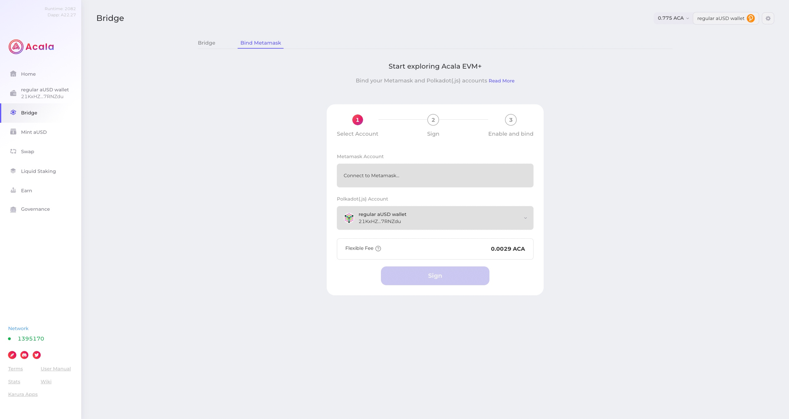
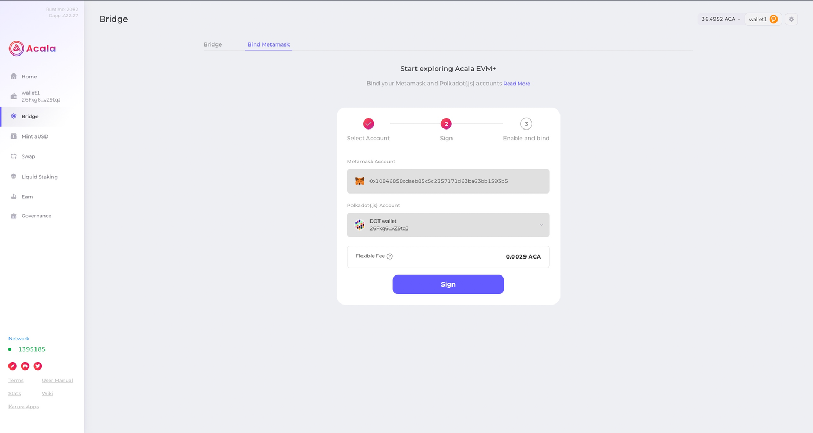
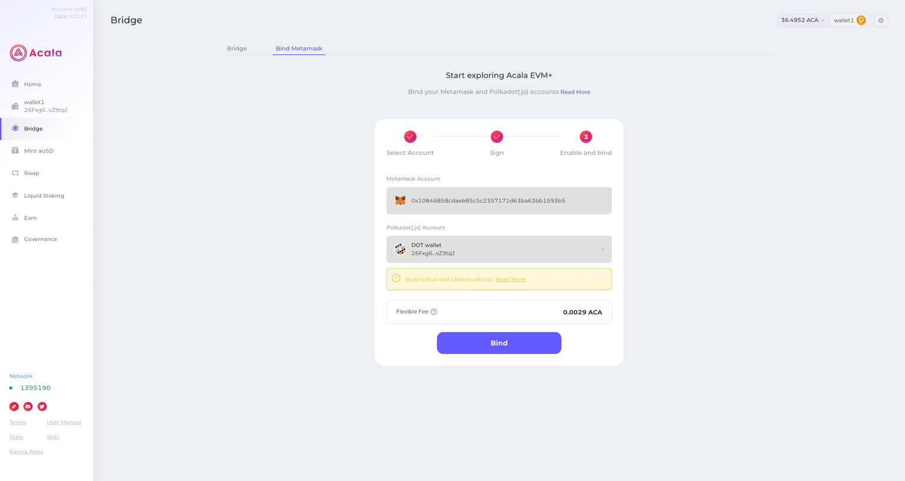
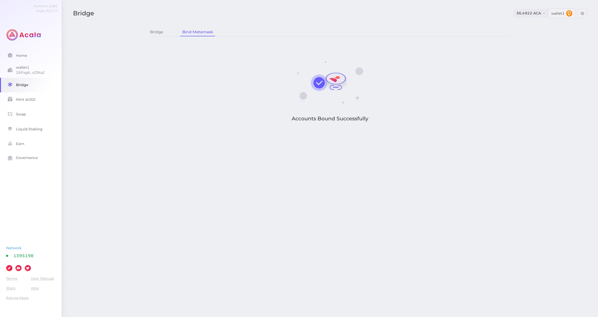

# Account binding

Note that the binding functionality has some limitations by design:

Binding can only be done between a Substrate and a MetaMask account

Neither account can be pre-bound to the other. In addition, there is no unbinding function after binding.

## Prepare Substrate account

use [Polkadot.js](https://polkadot.js.org/extension/) to create an substrate account

## Prepare Evm account

use [Metamask](https://metamask.io/download/) to create an evm account

## Switch to AcalaEVM + Network

Before binding the account, please add the [network](/base/network.md) and switch to the network.

## Bind EVM+ account

Go to "Bind MetaMask" in your Acala application. Click Connect to MetaMask and select the account you want to connect to. Do the same for your Substrate account.

Please double-check that you have linked the correct account as this action cannot be undone. Click Sign.

Click Bind. In order to bind, you must have a Substrate account. And there is a certain amount of ACA as Gas.

You should now see that your account has been successfully linked!

