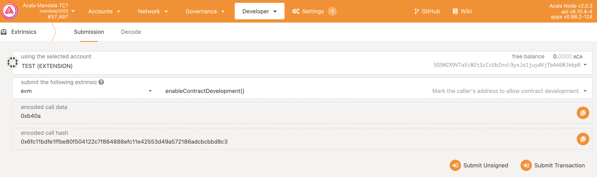

# Register developer

If you need to develop a contract on the Acala Evm+ network, you must first register as a developer before you will be allowed to publish the contract.

- open [Polkadot.js](https://polkadot.js.org/apps/?rpc=wss%3A%2F%2Fmandala-tc9-rpc.aca-staging.network%2Fws#/extrinsics)  **Developer** ，choose **Extrinsics**。

- Select the target account from the top drop-down list

- Select from external drop-down menu **evm**

- Select from the drop-down list **enableContractDevelopment()**

- Click Submit Transaction and sign and submit

