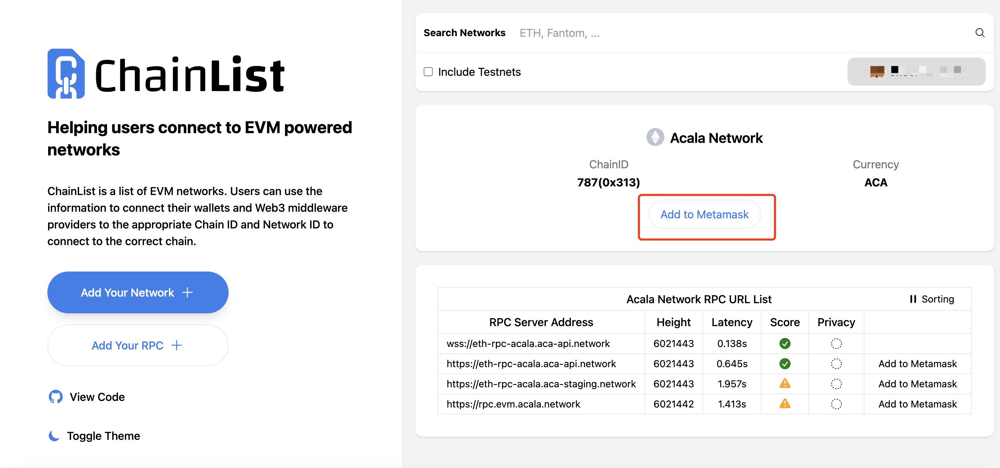
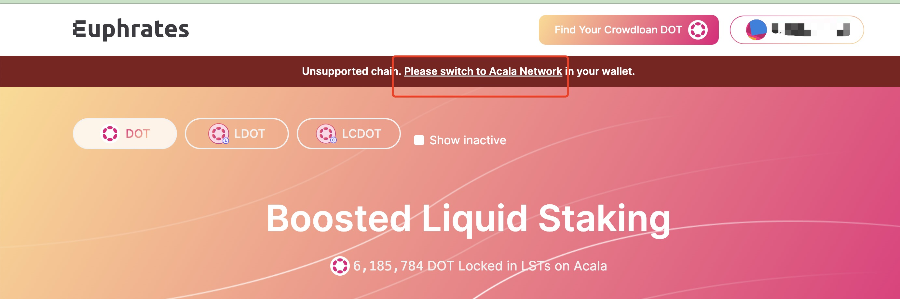

# Network settings

## Quickly add a network

You can add it via [Acala](https://chainlist.org/chain/787) on ChainList by clicking Add to Metamask




## Manually configure the network

Add the Acala network manually by opening the MetaMask wallet and going to Settings->Network->Add Network and entering the following information

```
Network Name: Acala

New RPC URL: https://eth-rpc-acala.aca-api.network/

Chain ID: 787

Currency Symbol: ACA

Block Explorer URL: https://blockscout.acala.network/ 
```


##  Visit Euphrates Add Network

Click Please switch to Acala Network to add Acala Network via the [Eurphrates](https://farm.acala.network/)


