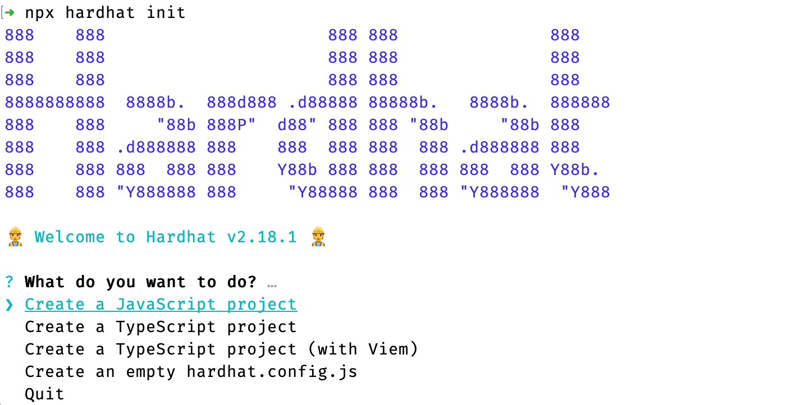

# Contract deployment

## Deploy contracts using hardhat

Hardhat is a popular smart contract development framework. We will use Hardhat to deploy a simple Counter smart contract to the Acala Evm+ network.

For complete instructions on how to use Hardhat, see the [Hardhat official documentation](https://hardhat.org/hardhat-runner/docs/getting-started#overview).

## Install
Hardhat is used in the project via local installation. This way your environment is reproducible and future version conflicts can be avoided.

To install it, you need to create an npm project, go into an empty folder, and run npm init. and follow its instructions. After the project is initialized, run:
```
npm install --save-dev hardhat
```

## quick start
Create the Hardhat project by running npx hardhat in the project folder:



## Create a deployment account
Create a **.env** file in your project root directory and replace **my private key** with your private key

```
ACCOUNT_PRIVATE_KEY='my private key'
```

## Configure Hardhat
Open the **hardhat.config.js** file and paste the following code
```
    require("dotenv").config();
    require("@nomicfoundation/hardhat-toolbox");

    module.exports = {
        solidity: "0.8.19",
        paths: {
            artifacts: "./src",
        },
        networks: {
            acala: {
            url: `https://eth-rpc-acala.aca-api.network`,
            accounts: [process.env.ACCOUNT_PRIVATE_KEY],
            },
        },
    };
```

## Compile contract
Compile your contract code
```
npx hardhat compile
```

## Deploy contract
Execute deployment script
```
npx hardhat run scripts/deploy.js --network acala
```
