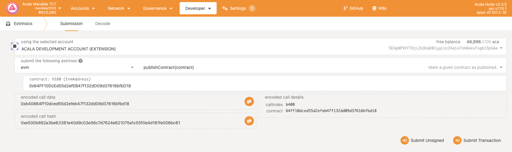
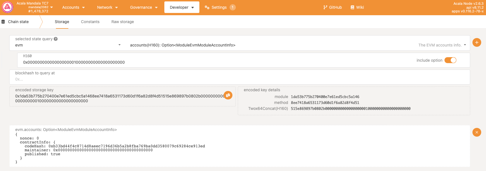

## publish

Any contract can only be publicly accessed after it is published. This is different from other evm networks. Developers must pay attention to this. Only the contract owner has the authority to publish the contract.

- In **Polkadot.js**, under the **Submission** tab, select **evm** from the external drop-down menu

- Select **publishContract(contract)** from the Method/Action drop-down list

- Fill in the contract address

- Click to submit transaction

## Verification status

- Using the **Storage** tab, select **evm** from **select state query**

- Select **account(H160)**

- Fill in the contract address

- Click to submit transaction

- Return result **published** indicates that the contract has been published

## Sub-contract release

If your smart contract has a contract factory function, the child contract will inherit the release status of the parent smart contract.

This means that sub-contracts created using the contract factory of a published smart contract have been published and do not need to be published manually.