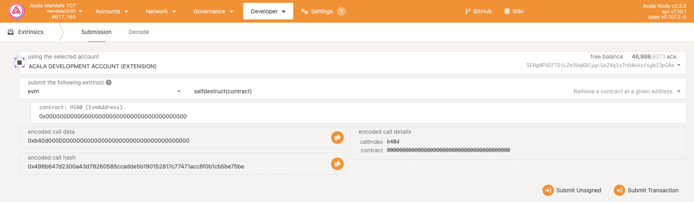

# Delete contract

Only the owner of the smart contract has the right to delete the contract. After the contract is deleted, the rent paid by the smart contract will be returned to the address where the contract was deleted.

- Open the **Polkadot.js** chain explorer and open the **Extrinsics** section.

- In **submit the following extrinsic**, select the **evm** option. Select **selfdestruct** and paste the address of the smart contract you want to delete into the input field below it.

- All that’s left to do is press the button **Submit transaction**, which will open your Polkdadot.js wallet and prompt you to sign the transaction. Once you sign and submit, your smart contract will be deleted and the storage rent will be refunded.

