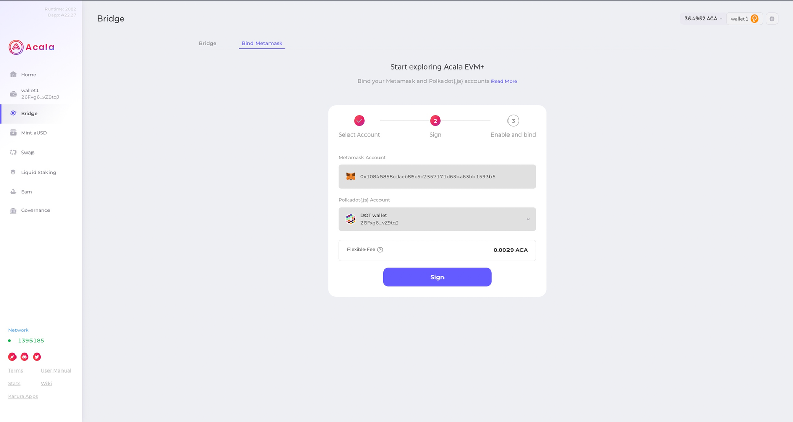
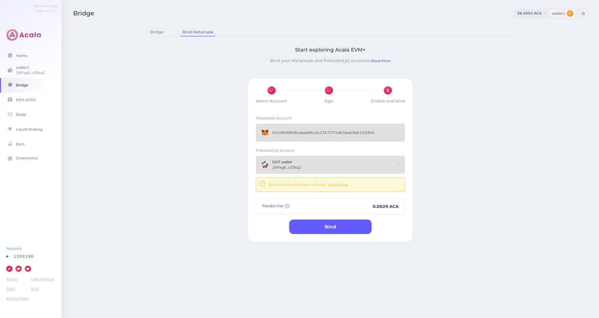
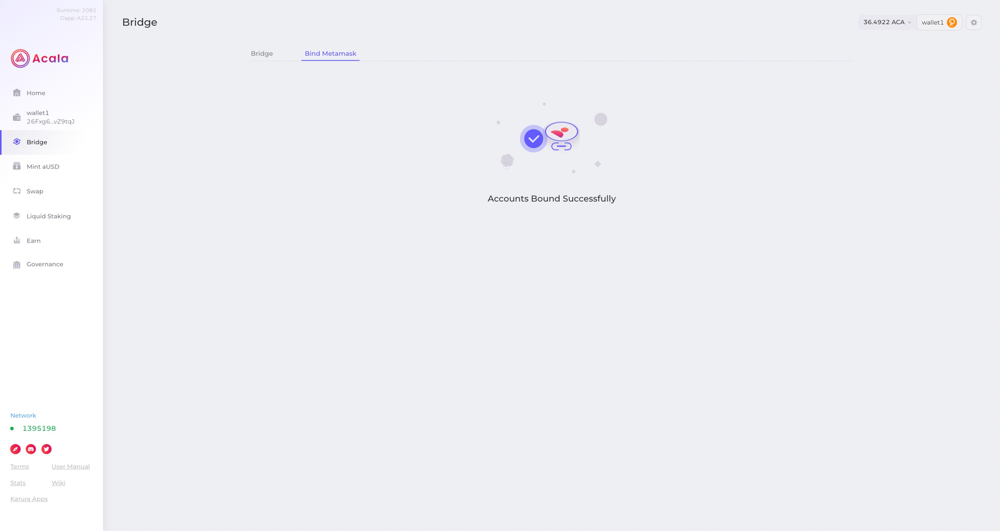

# 账户绑定

请注意，绑定功能在设计上有一些限制：

只能在一个 Substrate 和一个 MetaMask 帐户之间进行绑定

两个帐户都不能预先绑定到另一个帐户。此外，绑定后没有取消绑定功能。

## 准备Substrate账户

使用 [Polkadot.js](https://polkadot.js.org/extension/) 可以创建 substarte 账户

## 准备Evm账户

使用 [Metamask](https://metamask.io/download/) 可以创建 evm 账户

## 切换到 AcalaEVM + 网络

账户绑定前，请先添加该[网络](/base/network.md),并切换到该网络，

## 绑定 EVM+ 账户

转到Acala 应用程序中的“绑定 MetaMask”。单击Connect to MetaMask并选择您要连接的帐户。对您的 Substrate 帐户执行相同的操作。

请仔细检查您是否绑定了正确的帐户，因为此操作无法撤消。点击Sign。

单击Bind。为了绑定，您必须拥有 Substrate 帐户。并且有一定量的ACA作为Gas。

现在您应该看到您的帐户已成功绑定！

