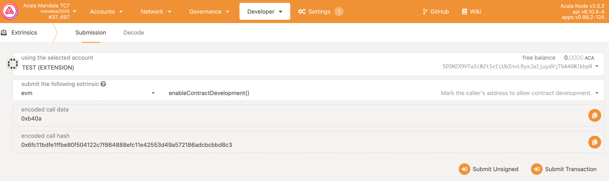

# 注册开发者

如果需要在 Acala Evm+ 网络开发合约，必须先注册开发者，才会被许可发布合约。

- 打开 [Polkadot.js](https://polkadot.js.org/apps/?rpc=wss%3A%2F%2Fmandala-tc9-rpc.aca-staging.network%2Fws#/extrinsics) 的 **Developer** ，然后选择 **Extrinsics**。

- 从顶部下拉列表中选择目标帐户

- 从外部下拉菜单中选择 **evm**

- 下拉列表中选择 **enableContractDevelopment()**

- 单击提交交易并签名并提交

