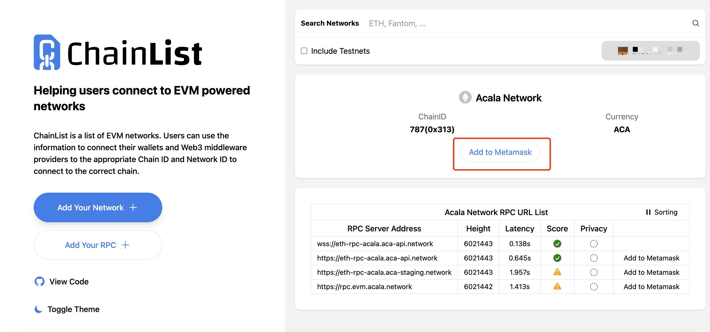
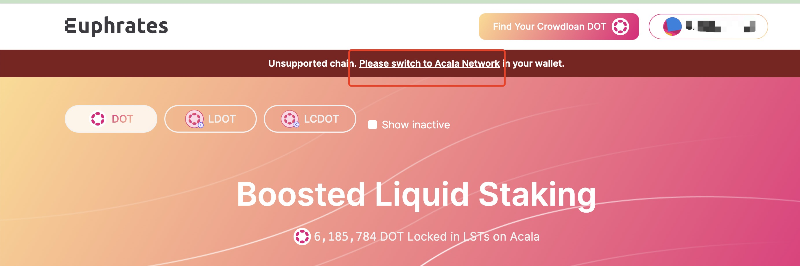

# 网络设置

## 快速添加网络

您可以通过ChainList 上的 [Acala](https://chainlist.org/chain/787) 点击 Add to Metamask 添加它




## 手动配置网络

通过打开 MetaMask 钱包并转到“设置”->“网络”->“添加网络”并输入以下信息来手动添加 Acala 网络

```
Network Name: Acala

New RPC URL: https://eth-rpc-acala.aca-api.network/

Chain ID: 787

Currency Symbol: ACA

Block Explorer URL: https://blockscout.acala.network/ 
```


## 访问Euphrates 添加网络

通过Acala 网络 Eurphrates 网站点击 Please switch to Acala Network 来添加 Acala 网络


