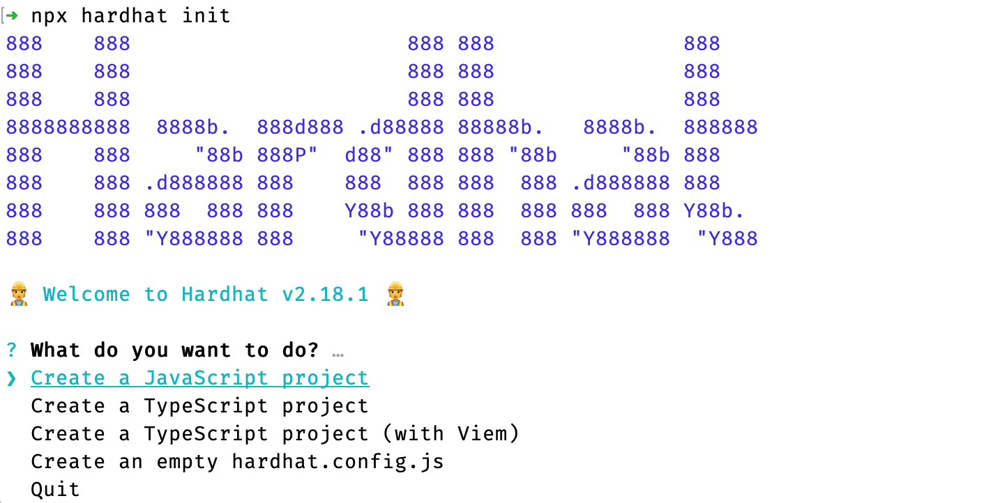

# 合约部署

## 使用hardhat部署合约

Hardhat 是一种流行的智能合约开发框架。我们将使用 Hardhat 将简单的 Counter 智能合约部署到 Acala Evm+ 网络。

有关如何使用 Hardhat 的完整说明，请参阅 [Hardhat 官方文档](https://hardhat.org/hardhat-runner/docs/getting-started#overview)。

## 安装
Hardhat是通过本地安装在项目中使用的。这样你的环境就可以重现，也可以避免未来的版本冲突。

要安装它，你需要创建一个npm项目，进入一个空文件夹，运行npm init。 并遵循其指示操作。项目初始化之后，运行：

```
npm install --save-dev hardhat
```

## 快速开始
通过在项目文件夹中运行npx hardhat来创建Hardhat项目:



## 创建部署账号
在你的项目根目录创建 **.env** 文件，将 **my private key** 替换为你的私钥
```
ACCOUNT_PRIVATE_KEY='my private key'
```

## 配置Hardhat
打开 **hardhat.config.js** 文件，黏贴下面代码
```
    require("dotenv").config();
    require("@nomicfoundation/hardhat-toolbox");

    module.exports = {
        solidity: "0.8.19",
        paths: {
            artifacts: "./src",
        },
        networks: {
            acala: {
            url: `https://eth-rpc-acala.aca-api.network`,
            accounts: [process.env.ACCOUNT_PRIVATE_KEY],
            },
        },
    };
```

## 编译合约
编译你的合约代码
```
npx hardhat compile
```

## 部署合约
执行部署脚本
```
npx hardhat run scripts/deploy.js --network acala
```
