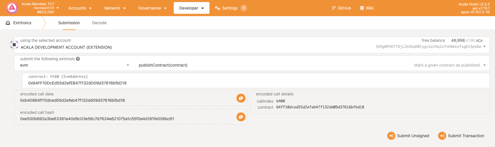
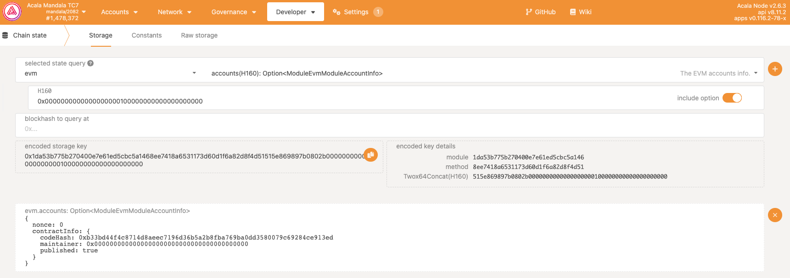

## 发布

任何合约只有发布才能在被公开访问，这一点和其他evm 网络有所不同，开发者务必注意。只有合约拥有者才有发布合约的权限。

- 在 **Polkadot.js** 的 **Submission** 选项卡下，从外部下拉菜单中选择 **evm**

- 从方法/操作下拉列表中选择 **publishContract(contract)**

- 填写合约地址

- 点击提交交易

## 验证状态

- 使用 **Storage** 选项卡，从 **select state query** ß中选择 **evm**

- 选择 **account(H160)**

- 填写合约地址

- 点击提交交易

- 返回结果 **published** 表明合约已发布

## 子合约发布

如果您的智能合约具有合约工厂功能，则子合约将继承父智能合约的发布状态。

这意味着使用已发布的智能合约的合约工厂创建的子合约已经发布，不需要手动发布。